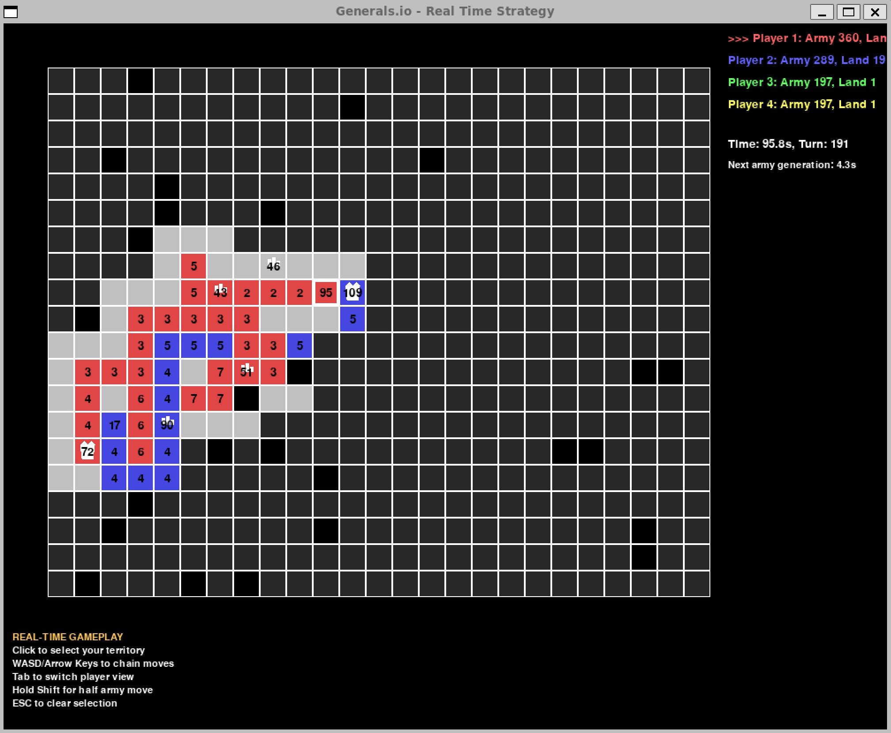
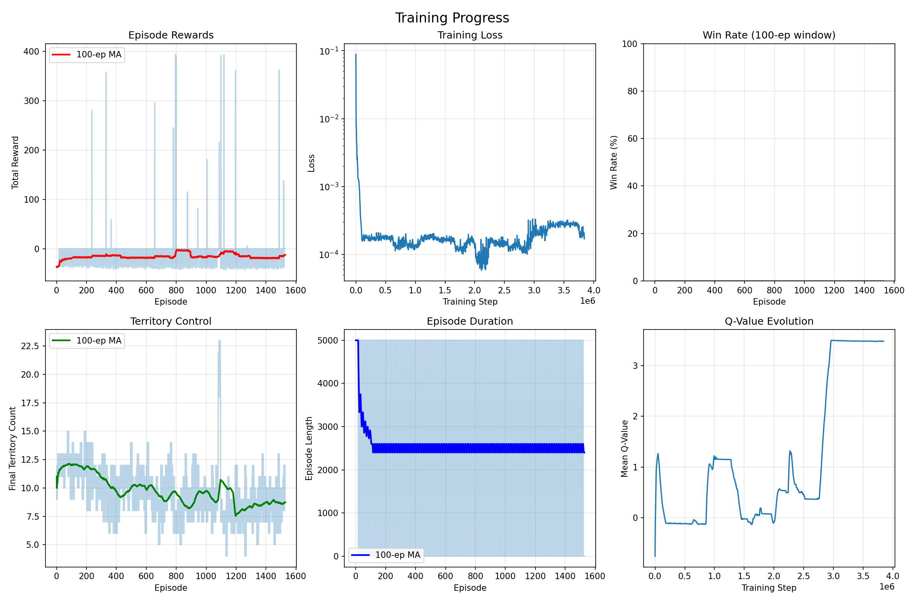

# Generals.io AI - Reinforcement Learning Project

A Python implementation of the popular Generals.io real-time strategy game with multiple AI agents trained using reinforcement learning techniques.

## 🎮 About Generals.io

Generals.io is a real-time strategy game where players compete to capture territory and eliminate opponents. Each player starts with a general (crown symbol) and must expand their territory by moving armies between adjacent cells. The goal is to capture the enemy general while protecting your own.

### Game Features

- **Real-time gameplay** with 0.5-second turns
- **Fog of war** - players can only see their territory and adjacent cells
- **Territory control** - captured cells generate armies over time
- **Cities** - special cells that provide additional army generation
- **Mountains** - impassable terrain that blocks movement
- **Multiple players** - support for 1-4 players in a single game

### Game Mechanics

- **Army Generation**: Generals and cities generate 1 army per turn (0.5 seconds)
- **Territory Bonus**: All owned cells generate 1 army every 25 turns (12.5 seconds)
- **Movement**: Move armies from owned cells to adjacent cells
- **Combat**: When attacking, armies fight and the stronger force wins
- **Victory**: Capture the enemy general to win

## 📸 Screenshots & Visualizations



## 🚀 Quick Start

### Prerequisites

```bash
pip install torch numpy pygame matplotlib pandas tensorboard gym
```

### Running the Base Game

```bash
python generals.py
```

**Controls:**

- **Mouse**: Click to select territory, right-click to move
- **WASD/Arrow Keys**: Chain moves from selected cell
- **Shift**: Move half army instead of full army
- **Tab**: Switch between player views
- **ESC**: Clear selection
- **R**: Restart game (when game over)

## 🤖 AI Agents & Training

This project includes several AI agents and training scripts:

### 1. DQN Agent Training

```bash
# Train a DQN agent from scratch
python gpu_dqn_training.py

# Train with specific parameters
python gpu_dqn_training.py --episodes 5000 --batch-size 256 --lr 0.0005
```

### 2. DQN Agent Training against Greedy

```bash
# Train DQN agent against a greedy algorithm
python train_reinforce_vs_greedy.py --model_path checkpoints/latest_checkpoint.pth

# Custom training parameters
python train_reinforce_vs_greedy.py \
    --model_path checkpoints/latest_checkpoint.pth \
    --episodes 3000 \
    --lr 0.001 \
    --gamma 0.99
```

### 3. Tournament Evaluation

````bash
# Run tournament between DQN and Greedy agents
python greedy_vs_dqn.py --model checkpoints/latest_checkpoint.pth --games 100

### 4. AI Agent Demo

```bash
# Play against AI with visualization
python generals_rl_demo.py checkpoints/latest_checkpoint.pth

# Play without rendering (faster)
python generals_rl_demo.py checkpoints/latest_checkpoint.pth --no-render

# Play multiple games
python generals_rl_demo.py checkpoints/latest_checkpoint.pth --games 5

# Analyze agent performance
python generals_rl_demo.py checkpoints/latest_checkpoint.pth --analyze --games 20
````

### 5. Greedy Baseline Agent

```bash
# Evaluate greedy baseline agent
python greedy_baseline_agent.py --episodes 200 --grid 25
```

## ⚙️ Configuration & Constants

### Game Constants (`generals.py`)

```python
# Display settings
WINDOW_WIDTH = 1000
WINDOW_HEIGHT = 800
GRID_WIDTH = 25
GRID_HEIGHT = 20
CELL_SIZE = 30

# Game timing
TURN_DURATION = 0.5  # Each turn is 0.5 seconds
ARMY_GENERATION_INTERVAL = 25 * TURN_DURATION  # Every 12.5 seconds

# Map generation
num_mountains = random.randint(15, 25)  # Number of mountains
num_cities = random.randint(8, 12)      # Number of cities
min_distance = 15  # Minimum distance between generals
```

### Training Constants (`gpu_dqn_training.py`)

```python
# Training hyperparameters
lr = 5e-4                    # Learning rate
batch_size = 256            # Batch size for training
gamma = 0.99                # Discount factor
epsilon_start = 1.0         # Initial exploration rate
epsilon_decay = 0.995       # Exploration decay rate
epsilon_min = 0.05          # Minimum exploration rate

# Environment settings
num_parallel_envs = 4       # Number of parallel environments
buffer_capacity = 200000    # Replay buffer size
update_target_every = 1000  # Target network update frequency
```

### DQN Constants (`train_reinforce_vs_greedy.py`)

```python
# Reward shaping constants
REWARD_CONSTANTS = {
    'win_bonus': 1000.0,
    'loss_penalty': -200.0,
    'city_capture_bonus': 50.0,
    'enemy_territory_bonus': 10.0,
    'territory_gain_multiplier': 5.0,
    'step_penalty': -0.002,
    'invalid_move_penalty': -0.1,
    'movement_bonus': 0.005,
    'frontier_bonus': 0.01,
    'frontier_growth_bonus': 0.02,
    'exploration_bonus': 0.005,
    'enemy_city_spotting_bonus': 1.0
}

# Training parameters
DEFAULT_LEARNING_RATE = 0.001
DEFAULT_EPISODES = 3000
DEFAULT_GAMMA = 0.99
DEFAULT_ENTROPY_BETA = 0.01
DEFAULT_GRADIENT_CLIP = 0.5
```

## 📊 Training & Evaluation

### Training Progress

Training progress is automatically logged and visualized:

- **TensorBoard logs**: `runs/` directory
- **Training statistics**: `training_stats/` directory
- **Model checkpoints**: `checkpoints/` directory
- **Tournament results**: CSV files with timestamps

### Model File Naming

- **DQN Training**: Creates `checkpoints/checkpoint_ep{episode}.pth` and `checkpoints/latest_checkpoint.pth`
- **PPO Training**: Creates `runs/policy_ep{episode:05d}.pth` and `runs/final_model.pth`
- **Demo Script**: Automatically finds `.pth` files in `checkpoints/` directory

### Monitoring Training

```bash
# View TensorBoard logs
tensorboard --logdir runs/

# Check training statistics
ls training_stats/
cat training_stats/training_summary.json
```

### Performance Metrics

- **Win Rate**: Percentage of games won
- **Average Reward**: Mean episode reward
- **Territory Control**: Average final territory count
- **Episode Length**: Average game duration
- **Invalid Move Rate**: Percentage of invalid actions

## 🏗️ Project Structure

```
generals-ai/
├── generals.py
├── generals_rl_env_gpu.py
├── gpu_dqn_training.py
├── train_reinforce_vs_greedy.py
├── greedy_vs_dqn.py
├── generals_rl_demo.py
├── greedy_baseline_agent.py
├── policy_network.py
├── DQN_agent.py
├── assets/
│   ├── generals_screenshot.png
│   └── statistics_dqn.png
├── checkpoints/
│   ├── checkpoint_ep{episode}.pth
│   └── latest_checkpoint.pth
├── runs/
│   ├── generals_optimized_{timestamp}/
│   ├── policy_ep{episode:05d}.pth
│   └── final_model.pth
├── training_stats/
│   ├── episode_stats.csv
│   ├── training_stats.csv
│   ├── evaluation_stats.csv
│   ├── training_curves.png
│   └── training_summary.json
├── tournament_results_{timestamp}.csv
└── README.md
```

### Network Architecture

The agents use convolutional neural networks with:

- **Input**: 6-channel observation (owner, army, city, general, mountain, visibility)
- **Convolutional layers**: 3 layers with batch normalization
- **Dueling DQN**: Separate value and advantage streams
- **Output**: Q-values for all possible actions

### Action Space

- **Full action space**: 2000 actions (25×20×4 directions)
- **Reduced action space**: Only valid moves (dynamically sized)
- **Movement**: 4 directions (up, down, left, right)

## 🐛 Troubleshooting

### Common Issues

- **If CUDA out of memory**: Reduce batch size or number of parallel environments
- **Slow training**: Increase number of parallel environments or use Google Collab
- **Poor performance**: Adjust reward constants or training hyperparameters
- **Invalid moves**: Check action space configuration and environment setup

## 📈 Results & Benchmarks



## 🙏 Acknowledgments

- Original Generals.io game concept(My implementation is a rough copy)
